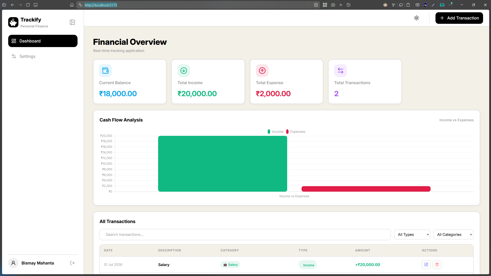

# 💸 Trackify — Personal Finance Tracker

A clean, fast personal expense tracker built with **React** and **Redux Toolkit**. Add, edit, and delete transactions, track income vs. expenses in real time, filter through your history, and switch currencies — all backed by a single, predictable Redux store.

Built as part of the **Redux Toolkit Mini Hackathon** at Sheryians Coding School.

<!-- 🖼️ Add a screenshot or GIF of the dashboard here -->
<!--  -->

---

## ✨ Features

- **Add / Edit / Delete transactions** — income or expense, with category, description, amount, and date
- **Live dashboard** — current balance, total income, total expense, and transaction count, all updating instantly
- **Cash flow chart** — income vs. expenses visualized with Chart.js
- **Search & filter** — filter transactions by type and category, or search by description
- **Multi-currency support** — switch between INR, USD, EUR, GBP, and JPY; amounts reformat instantly across the app
- **Light / Dark theme** — toggleable, persisted across sessions
- **Auth flow** — register/login with protected routes, each user's data kept separate
- **Persistent storage** — transactions, currency, and user data survive a page refresh via localStorage
- **Responsive design** — usable on both desktop and mobile

---

## 🛠️ Tech Stack

| Layer | Tech |
|---|---|
| UI | React 19, Tailwind CSS |
| State Management | Redux Toolkit, React-Redux |
| Routing | React Router |
| Charts | Chart.js + react-chartjs-2 |
| Icons | Lucide React |
| Build Tool | Vite |

---

## 📂 Project Structure

```
src/
├── store/                     # All Redux logic lives here
│   ├── store.js                # configureStore + localStorage sync
│   └── transactionsSlice.js    # createSlice: state + reducers + actions
├── contexts/                  # Auth, Theme, Toast (kept outside Redux)
├── routes/                    # Route protection (ProtectedRoute / PublicRoute)
├── layouts/                   # MainLayout, AuthLayout
├── pages/                     # Dashboard, Settings, Login, Register
└── components/
    ├── dashboard/               # StatCard, TransactionTable, CashFlowChart, modals
    ├── layout/                  # Navbar, Sidebar
    └── settings/                # Profile, Currency, Appearance, Danger Zone
```

---

## 🚀 Getting Started

### Prerequisites
- Node.js (v18 or higher recommended)
- npm

### Installation

```bash
# Clone the repository
git clone https://github.com/<your-username>/<your-repo>.git
cd <your-repo>

# Install dependencies
npm install

# Start the dev server
npm run dev
```

The app will be running at `http://localhost:5173` (default Vite port).

### Build for production

```bash
npm run build
```

---

## 🧠 How State Management Works

All transaction data (transactions list, currency, and user name) lives in a single Redux slice — `transactionsSlice.js`. Components read from it with `useSelector` and update it by dispatching actions like `addTransaction`, `editTransaction`, and `deleteTransaction`. Every component that depends on that data — the stat cards, the chart, and the table — re-renders automatically whenever the store changes, without any manual prop-passing between them.

Auth, theme, and toast notifications are intentionally kept in **React Context** instead of Redux, since they're simpler, less frequently shared pieces of state.

---

## 📖 Learning Documentation

This project was built as part of a self-learning challenge on Redux Toolkit. My full write-up on what I learned — core concepts, data flow, challenges faced, and more — is available here:

📄 [Redux Toolkit Learning Documentation](./docs/Redux-Toolkit-Documentation.pdf)

---

## 🔗 Links

- 🌐 Live Demo: *[(Vercel link)](https://expense-tracker-redux-iota.vercel.app/)*
- 🎥 Explanation Video: *([LinkedIn](https://www.linkedin.com/posts/bismay-sundar-mahanta_sheryianscodingschool-reduxtoolkit-reactjs-ugcPost-7487404890772897793-qcbl/))*
- ✍️ LinkedIn Post: *([LinkedIn Post](https://www.linkedin.com/posts/bismay-sundar-mahanta_sheryianscodingschool-reduxtoolkit-reactjs-ugcPost-7487404890772897793-qcbl/))*

---

## 📄 License

This project was built for educational purposes as part of a coding challenge.